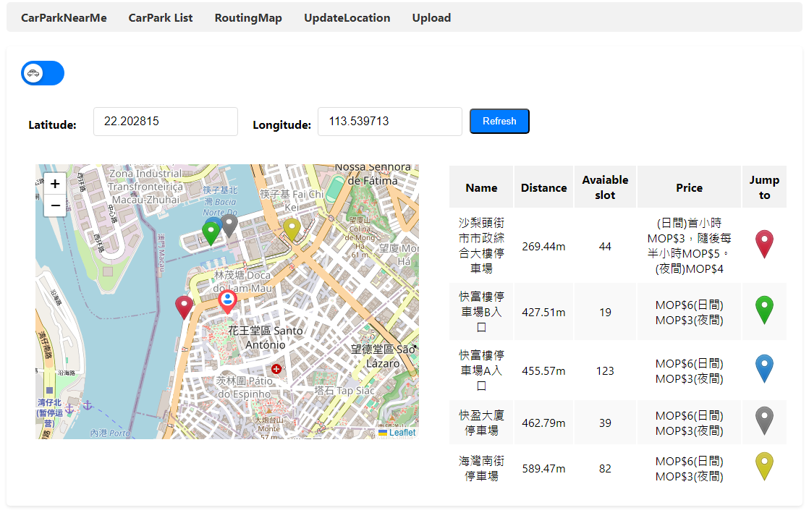
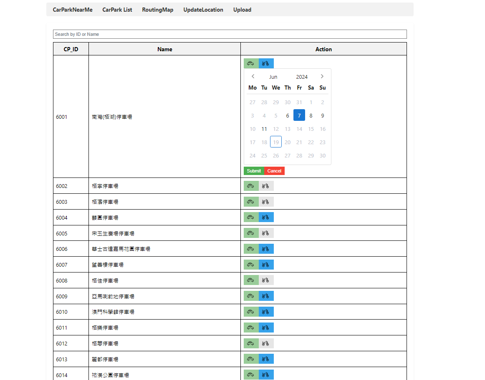

# Near carpark (Macau)

This project aims to use car park data from Macau's open data platform to help find available carparks near user. And also carpark analyst data with a routing map to help the user plan their trip. This project was first built with MSSQL and halfway switched to MongoDB for learning purposes. This repository only contains the backend part, the frontend is at https://github.com/billHuang1220/NearCarParkVue.

## Dependencies
1. .NET 8.0 - ASP.NET Core Web API
2. MS SQL Server 2022 
3. Mongodb 
4. Vue3
5. Macau open data 

## Features
1. Find the nearest and available carpark near the user according to the user's latitude, longtitue, and car type
2. Background service to collect carpark analyst data
3. Routing map for waypoints and use the first feature to find nearby carpark
4. Insert, update, delete location for routing map
5. Bulk insert, update
6. The background service for collecting carpark analyst data is isolated from web API which they can run independently 
7. Soft delete, the deleted record in the database is marked as deleted without actually deleting it.
## Usage

1. On this page, users can select the type of vehicle they have, either a car or a motorcycle, and find the available car parks nearby.

2. On this page user can access car park analysis data, which assists them in planning their trips effectively. They can view a list of available car parks and make informed decisions based on the analysis provided.

Here is information about the availability of parking slots during different time intervals. Users can check the availability of slots and plan their visits accordingly.

3. On this page users can add locations in the routing map and click the marker button to check available carpark near that location.

# Location Management 
The following two pages are for managing locations for the routing map.
4.  Here can Insert, update and delete locations.

5. This page is for uploading .csv file to perform bulk insert, update.

