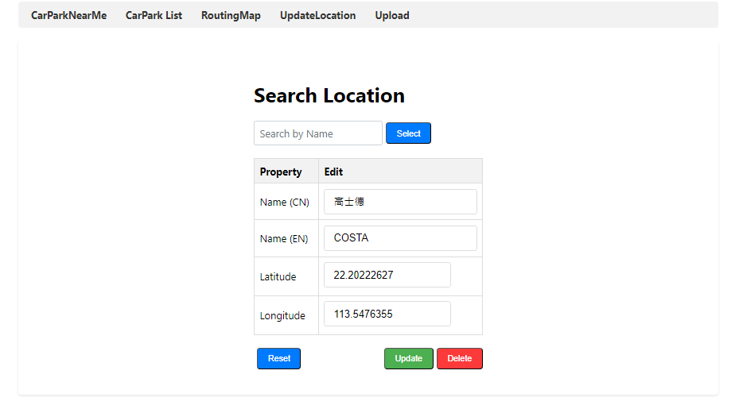

# Near carpark (Macau)

This project is aim to use car park data from Macau open data platform to help use find available carpark near user. And also carpark analyst data with routing map to help user plan their trip.

## Dependencies
1. .NET 8.0 - ASP.NET Core Web API
2. MS SQL Server 2022 
3. Mongodb 
4. Vue3
5. Macau open data 

## Features
1. Find nearest and available carpark near user according to user's latlng and car type
2. Background service to collect carpark analyst data
3. Routing map for way points and use first feature to find near carpark
4. Insert, update, delete location for routing map
5. Bulk insert, update, delete locations (Not done)
6. The background service for collecting carpark analyst data is isolate from web API which they can run independently 

## Usage

1. User can select type of their vehicle from car or motorcycle and find the available carparks near.

2. In this page user can check the analyst carpark data to better plan their trip.

Here user can find the available slot for each time interval.

3. In this page use can add location in routing map and click the marker button to check available carpark near that location.

# Location Management 
- Following two page is for manage locations for routing map.
4.  Here can Insert, update and delete location.

5. This page is for upload .csv file to perform bulk insert, update, delete.

